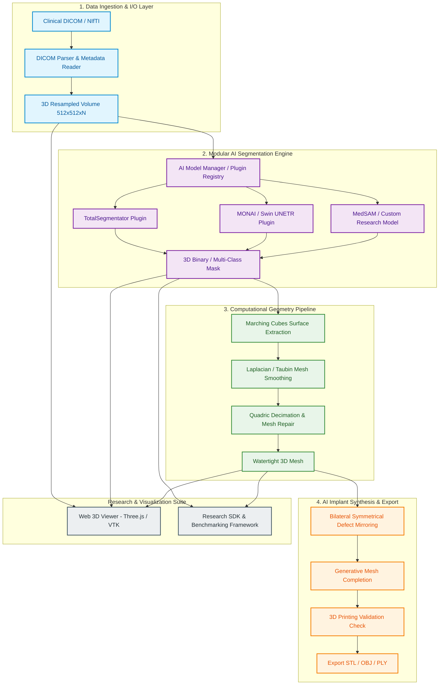

# MedAI-OS: Medical AI Laboratory Operating System & 3D Reconstruction Platform

<div align="center">


**An End-to-End Modular Platform & Research SDK for 3D DICOM Processing, Deep Learning Medical Segmentation, Computational Geometry, and AI Implant Synthesis.**

[Overview](#-overview) • [Key Features](#-key-features) • [System Architecture](#-system-architecture) • [Research SDK](#-research-sdk--benchmarking) • [Quick Start](#-quick-start) • [Research Roadmap](#-research-roadmap)

</div>

---

## 📌 Overview

**MedAI-OS (Medical AI Laboratory Operating System)** is an open-source, modular research infrastructure engineered to bridge the gap between **raw 3D medical imaging (DICOM / NIfTI)**, **deep learning segmentation models**, **computational geometry processing**, and **generative AI implant design**.

In academic medical AI research, researchers frequently waste months building repetitive data loaders, mesh generators, visualization tools, and evaluation boilerplate before attempting novel AI algorithms. MedAI-OS provides a standardized **"Operating System" architecture** where each processing stage—from ingestion to 3D printing export—is decoupled into pluggable, benchmarkable modules.

### 🌐 Key Pillars
* **Bilingual Documentation**: Built for global research collaboration and academic applications.
* **Plug-and-Play AI Engine**: Seamlessly integrate state-of-the-art models (TotalSegmentator, MONAI, Swin UNETR, MedSAM, nnU-Net).
* **3D Geometry & CAD Pipeline**: Automatic Marching Cubes isosurface extraction, Laplacian/Taubin smoothing, quadric decimation, and watertight mesh repair.
* **Generative AI Implant Synthesis**: Deep shape completion and bilateral symmetry mirroring for cranial and orthopedic bone defect reconstruction.
* **Standalone Research SDK**: High-level Python SDK (`sdk/`) with built-in evaluation metrics (Dice, HD95, ASSD, IoU, Chamfer Distance) and experiment reporting.

---

## 🚀 Key Features

| Component | Technical Capabilities | Underlying Technologies |
| :--- | :--- | :--- |
| **Data Ingestion Layer** | DICOM series parsing, 3D voxel volume reconstruction, Hounsfield Unit (HU) windowing, orientation alignment, isotropic voxel resampling. | `pydicom`, `SimpleITK`, `NumPy` |
| **Plugin AI Engine** | Multi-class anatomical segmentation (femur, tibia, pelvis, skull, vertebrae). Pluggable inference manager supporting mock and live deep learning models. | `PyTorch`, `MONAI`, `TotalSegmentator`, `MedSAM` |
| **Interactive 3D Viewer** | Web-based real-time 3D rendering, slice clipping, multi-planar reconstruction (MPR), volume inspection, and measurement tools. | `Three.js`, `VTK.js`, `React`, `Vite` |
| **Geometry Engine** | Isosurface extraction, surface smoothing, polygon reduction, face normal repair, hole filling, watertight integrity verification. | `VTK`, `Trimesh`, `SciPy`, `scikit-image` |
| **AI Implant Engine** | Automated bone defect detection, bilateral reflection mirroring, neural implicit surface reconstruction for customized 3D implants. | `Trimesh`, `Open3D`, PyTorch Generative Models |
| **Research SDK & Benchmarking** | Metric logging (Dice, HD95, ASSD, Chamfer), automated experiment comparison, and paper-ready markdown report generation. | MedAI-OS `sdk`, `Pandas`, `Matplotlib` |

---

## 🏗️ System Architecture

MedAI-OS enforces a strict 4-layer decoupling strategy, allowing researchers to modify or evaluate any individual module without rewriting upstream data pipelines or downstream visualizers.



---

## 📂 Repository Topology

```text
Medical-AI-Laboratory-Operating-System/
├── app/                        # Core FastAPI Backend Application
│   ├── api/                    # REST API Endpoints (v1/v2)
│   │   ├── v1/
│   │   │   ├── api_volume.py   # DICOM Ingestion & Volume Management
│   │   │   ├── api_inference.py# AI Model Execution & Jobs
│   │   │   ├── api_mesh.py     # 3D Mesh Operations & Processing
│   │   │   └── api_implant.py  # Defect Reconstruction & Implant Synthesis
│   ├── core/                   # Platform Configuration & Security
│   ├── models/                 # SQLAlchemy Database Models
│   ├── schemas/                # Pydantic Data Transfer Objects
│   └── services/               # Core Domain Service Implementations
│       ├── ai/                 # Plugin Registry & AI Model Drivers
│       │   └── plugins/        # TotalSegmentator, Mock, MONAI Plugins
│       ├── geometry/           # VTK & Trimesh Surface Algorithms
│       └── implant/            # Symmetrical Reconstruction Services
├── frontend/                   # Web-based Interactive 3D Visualizer
│   ├── standalone-viewer.html  # Self-contained Three.js / VTK 3D Viewer
│   └── src/                    # React + Vite Frontend Source Code
├── sdk/                        # Standalone Python Research SDK
│   ├── dataset.py              # Medical Dataset Loaders
│   ├── experiment.py           # Fluent Research Experiment Builder
│   ├── metrics.py              # Quantitative Evaluation Suite (Dice, HD95, Chamfer)
│   ├── model.py                # Standardized Model Interfaces
│   └── examples/               # Academic Research Workflow Examples
├── scripts/                    # Automation & Maintenance Scripts
├── tests/                      # Pytest Test Suite (API, IO, Geometry, SDK)
├── alembic/                    # Database Schema Migrations
├── docker-compose.yml          # Container Orchestration Specification
├── Dockerfile                  # Application Container Specification
└── requirements.txt            # Python Dependencies Specification
```

---

## 🧪 Research SDK & Benchmarking

The **MedAI-OS SDK** provides a high-level fluent API designed specifically for medical AI researchers to run standardized benchmarks, record volumetric and surface metrics, and export paper-ready reports.

### Example SDK Research Workflow

```python
from sdk import Experiment

# 1. Define baseline scores for model benchmark comparison
baseline_metrics = {
    "dice_score": 0.820,
    "hausdorff_distance_mm": 4.12,
    "chamfer_distance": 0.015,
    "inference_time_sec": 0.05
}

# 2. Execute fluent experiment pipeline
(
    Experiment(
        experiment_name="femur_implant_medsam_eval",
        dataset_version="v2.1"
    )
    .train(model_name="MedSAM", epochs=5, lr=1e-4)
    .evaluate()
    .compare(baseline_metrics=baseline_metrics)
    .visualize()
    .generate_report(output_path="medsam_femur_report.md")
)
```

### Quantitative Metrics Supported
* **Volumetric Overlap**: Dice Similarity Coefficient (DSC), Intersection over Union (IoU / Jaccard Index).
* **Distance & Boundary**: Hausdorff Distance (95th percentile - HD95), Average Symmetric Surface Distance (ASSD).
* **3D Surface Topology**: Chamfer Distance (CD), Point-to-Surface RMSE.
* **Computational Efficiency**: Inference Latency (ms), Frames Per Second (FPS), Memory Footprint (VRAM/RAM).

---

## ⚡ Quick Start

### Prerequisites
* **Python**: `3.10` or higher
* **Docker & Docker Compose** *(Recommended)*
* **CUDA-compatible GPU** *(Optional, for accelerated deep learning inference)*

### Method 1: Launching with Docker Compose (Recommended)

```bash
# Clone the repository
git clone https://github.com/VIENDANBACK5/Medical-AI-Laboratory-Operating-System.git
cd Medical-AI-Laboratory-Operating-System

# Start all services (FastAPI Backend + Storage + Database)
docker-compose up --build
```

Access the API documentation at `http://localhost:8000/docs`.

---

### Method 2: Local Virtual Environment Setup

```bash
# 1. Create and activate a Python virtual environment
python -m venv .venv

# Windows (PowerShell):
.venv\Scripts\Activate.ps1

# Linux/macOS:
source .venv/bin/activate

# 2. Install dependencies
pip install --upgrade pip
pip install -r requirements.txt

# 3. Apply database migrations
alembic upgrade head

# 4. Start the FastAPI development server
uvicorn app.main:app --reload --host 0.0.0.0 --port 8000
```

---

### Running the Pytest Suite

```bash
# Run full automated test suite (API, Geometry, IO, AI Services, SDK)
pytest tests/ -v
```

---

### Launching the Interactive 3D Viewer

Open `frontend/standalone-viewer.html` directly in any modern browser, or launch the React viewer:

```bash
cd frontend
npm install
npm run dev
```

---

## 📡 REST API Reference Summary

| Method | Endpoint | Description |
| :--- | :--- | :--- |
| `POST` | `/api/v1/volume/upload` | Upload raw DICOM series or NIfTI volume. |
| `GET` | `/api/v1/volume/{id}/metadata` | Extract spatial spacing, matrix resolution, and HU range. |
| `POST` | `/api/v1/inference/predict` | Trigger AI segmentation job using specified plugin model. |
| `GET` | `/api/v1/inference/job/{id}` | Query asynchronous inference job status and output paths. |
| `POST` | `/api/v1/mesh/reconstruct` | Extract 3D mesh from segmentation mask via Marching Cubes. |
| `POST` | `/api/v1/mesh/optimize` | Apply Laplacian smoothing, quadric decimation, and repair. |
| `POST` | `/api/v1/implant/generate` | Generate symmetrical implant proposal for bone defects. |
| `GET` | `/api/v1/mesh/export/{id}` | Export watertight mesh in `.stl`, `.obj`, or `.ply` format. |

---

## 🎯 Academic Research Roadmap

For undergraduate and graduate researchers, MedAI-OS provides a strategic roadmap to transition from infrastructure engineering to high-impact paper publications:

```text
Phase 1: End-to-End Pipeline Infrastructure (MVP)
├── Plug pretrained segmentation models (TotalSegmentator / MONAI)
├── Automate DICOM -> Mask -> Marching Cubes -> STL export
└── Standardize REST API endpoints and data layer

Phase 2: Advanced Engineering & Visualization
├── Implement interactive 3D Web Viewer (Three.js / VTK.js)
├── Build interactive slice clipping, distance measurement, bone selection
└── Add mesh optimization routines (decimation, normal repair, smoothing)

Phase 3: Multi-Model Benchmark & Evaluation Platform
├── Implement unified evaluation engine (Dice, HD95, Chamfer, ASSD)
├── Benchmark TotalSegmentator vs Swin UNETR vs MedSAM on dataset
└── Build automated experiment report generator (MedAI-OS SDK)

Phase 4: Generative AI Research & Novel Contributions
├── Research AI Implant Recommendation (3D Shape Completion / Generative Models)
├── Novel algorithm: Neural Implicit Surface Completion for skull/femur defects
└── Publish findings in top-tier journals/conferences (MICCAI, IEEE TMI, IPMI)
```

### Module Research Potential Matrix

| Module / Research Topic | Technical Complexity | Current SOTA Maturity | Publication Potential |
| :--- | :---: | :---: | :---: |
| **CT → Bone Segmentation** | ⭐⭐⭐ | High (TotalSegmentator, nnU-Net) | ⭐⭐ |
| **Isosurface Mesh Extraction** | ⭐⭐ | Classical (Marching Cubes) | ⭐ |
| **Computational Mesh Repair** | ⭐⭐⭐ | Graphics Domain | ⭐⭐⭐ |
| **Volumetric to CAD Conversion** | ⭐⭐⭐⭐⭐ | Low (Mostly Manual CAD) | ⭐⭐⭐⭐⭐ |
| **AI Implant Synthesis / Completion** | ⭐⭐⭐⭐⭐ | Emerging (Generative AI / Diffusion) | ⭐⭐⭐⭐⭐ |
| **CAD → 3D Print Quality Verification** | ⭐⭐⭐⭐ | Manufacturing Domain | ⭐⭐⭐⭐ |

> **Strategic Advice for Applicants**: PIs in leading AI research labs value candidates who build **reusable infrastructure first** and **innovate algorithms second**. Demonstrating a modular framework like MedAI-OS proves system architectural maturity, strong software engineering, and scientific rigor.

---

## 📖 Citation

If you use MedAI-OS in your academic research, lab work, or master's/PhD thesis, please cite this project as follows:

```bibtex
@software{medai_os_2026,
  author = {Vien Dan Back},
  title = {MedAI-OS: Medical AI Laboratory Operating System \& 3D Reconstruction Platform},
  year = {2026},
  publisher = {GitHub},
  journal = {GitHub Repository},
  howpublished = {\url{https://github.com/VIENDANBACK5/Medical-AI-Laboratory-Operating-System}}
}
```

---

<div align="center">

**Developed with ❤️ for Medical AI Researchers & Engineers worldwide.**

</div>
